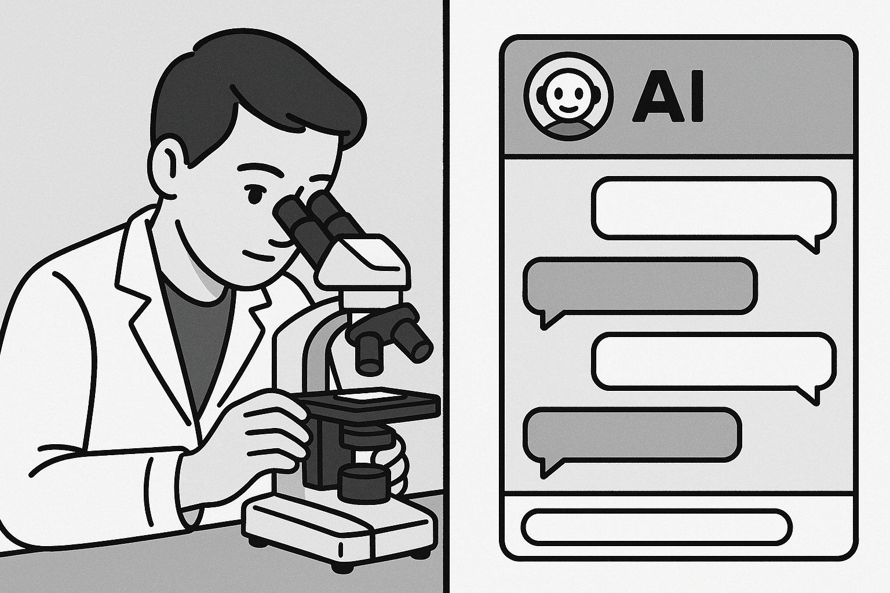
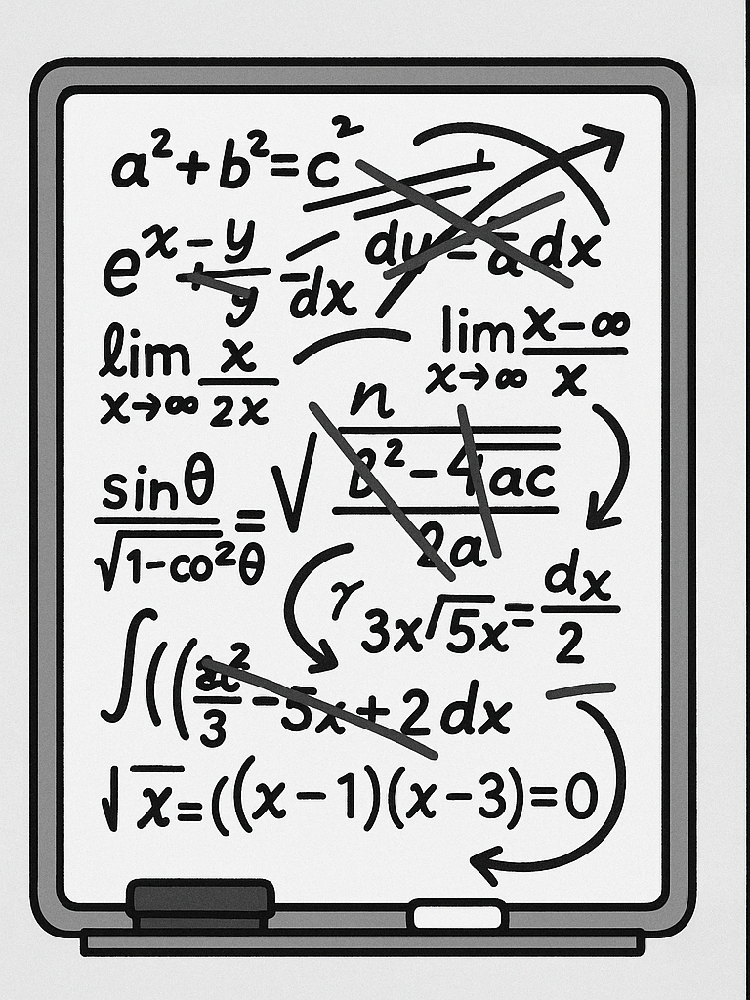
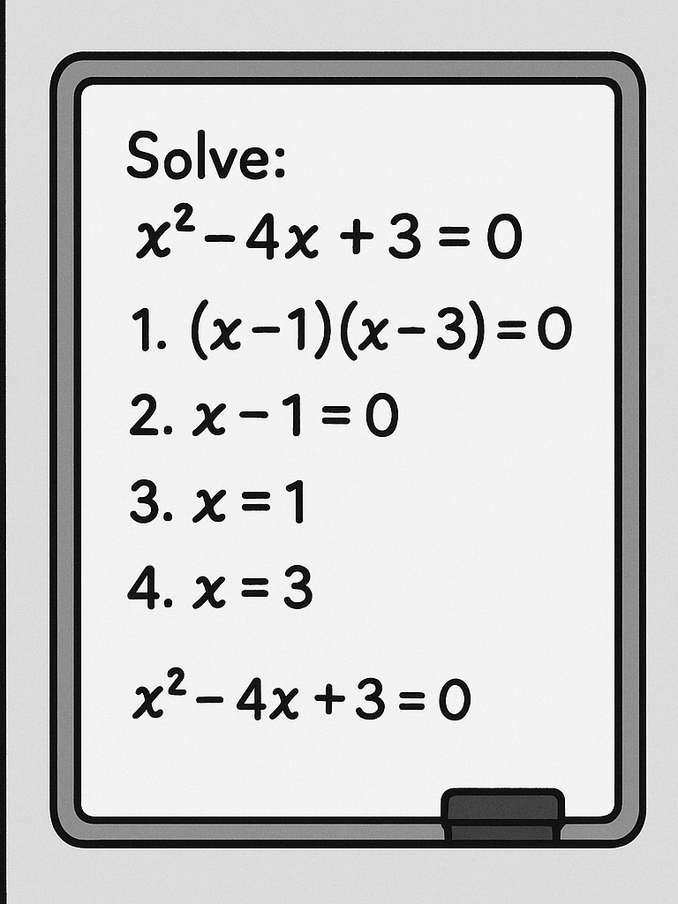

# Welcome! 

:::: {.columns}
::: {.column width="50%"}
## Today's Journey

- Understanding your AI assistant
- Why structure beats magic
- A proven 10-step research workflow
- Live demonstration
- **Your roadmap to AI-powered research**
:::

::: {.column width="50%"}

:::
::::

::: {.notes}
Welcome students. Today we're learning how to effectively manage AI tools for
research. This isn't about fancy prompts - it's about understanding how these
tools work.
:::


# Quick System Check! 📋 

:::: {.columns}
::: {.column width="50%"}
**Do you have access to:**

- ✅ Microsoft Copilot (copilot.microsoft.com)
- ✅ Internet connection
- ✅ Ability to download files

:::

::: {.column width="50%"}
**Can't Access Copilot?**

- Try ChatGPT (chat.openai.com) - free tier works
- Claude (claude.ai) - also free
- **Key point:** The principles work with ANY AI assistant

**Timing:** We'll have troubleshooting breaks at 15 and 35 minutes!
:::
::::


# The Problem: The "Everything" Prompt 

## Have you ever tried this?

- You ask AI to do a huge task all at once...
- "Analyse high-pressure processing for juice shelf life, tell me pros and cons, design an experiment for Vitamin C in orange juice, write the methods, and create expected results table"

# What do you get back? 😕

- ❌ Shallow, generic summary
- ❌ Forgets half your instructions
- ❌ Messy, unusable output

**Real Example:** "Write my entire literature review on plant proteins" → Gets 2 paragraphs of Wikipedia-level content

::: {.notes}
This happens because you're giving the AI too much to think about at once. It's
like asking someone to juggle while solving math problems.
:::


# The Solution: Think Like a Manager 🎯 

## Not a Magician! ✨

> **Big Idea:** Break complex research into small, logical steps

## The Golden Rule - **One Task, One Prompt**

Give your AI assistant one clear job at a time

**Let's explore why this simple rule is so powerful...**


# Quick Start Essentials 📸 

**The Most Important Prompt Template:**

```text
You are an AI research scientist specializing in [YOUR FIELD].

Task: [ONE SPECIFIC TASK]

Requirements:
- [SPECIFIC REQUIREMENT 1]
- [SPECIFIC REQUIREMENT 2]
- [SPECIFIC REQUIREMENT 3]

Format: [HOW YOU WANT THE OUTPUT]

Context: [BACKGROUND INFO IF NEEDED]
```

::: {.notes}
**Save this!** 80% of your AI interactions will use this basic structure
:::


# Reason 1: Limited "Working Memory" 🧠

:::: {.columns}
::: {.column width="50%"}
### ❌ The "Everything" Prompt

Scribbling 10 problems at once = No room for solutions
:::

::: {.column width="50%"}
### ✅ The Step-by-Step Approach

One problem, full space = Detailed, accurate results
:::
::::

**Takeaway:** A single, focused task gets the AI's full attention

::: {.notes}
LLMs have a context window - think of it as their working memory. When you fill
it with multiple complex tasks, each gets less attention and processing power.
:::


# Technical Detail: Context Windows 📊

## What's really happening?

- LLMs have **finite context windows** (8k-200k tokens)
- Token ≈ 0.75 words
- Each task competes for this limited space

## Example:
- LLM Context window: ~8,000 tokens
- Complex research prompt: ~500 tokens
- Response space needed: ~1,500 tokens per task
- **Result:** Only 3-4 tasks fit properly!

**Think of it like RAM:** Too many programs = computer slows down. Too many tasks = AI quality drops.

::: {.notes}
This is why breaking tasks down isn't just helpful - it's technically necessary for quality outputs.
:::


# Reason 2: Guiding the AI's "Thinking" 🧭

## LLMs Create Answers Piece by Piece

- Each word depends on previous words
- Complex prompts = mental shortcuts
- Structured prompts = logical reasoning

## Cooking Analogy 👨‍🍳

**❌ Bad:** "Make beef wellington"

*Chef might skip steps or use wrong ingredients*

**✅ Good:** 
1. "First, sear the beef"
2. "Next, prepare duxelles"
3. "Then, wrap in pastry"


::: {.notes}
By giving step-by-step instructions, you force the AI to build a logical argument, leading to much stronger outputs.
:::


# Reason 3: Easy Error Detection & Fixing 🔧

:::: {.columns}
::: {.column width="50%"}
### With a Giant Prompt
- Problem: Weak experimental method
- Solution: Re-run EVERYTHING
- Time lost: 10-15 minutes
- Quality: Hope for the best 🤞
:::

::: {.column width="50%"}
### With Our Workflow
- Problem: Weak experimental method
- Solution: Fix just that step
- Time lost: 2 minutes
- Quality: Keep what works ✓
:::
::::

**Benefit:** Iterative refinement = Higher quality + Less frustration


# Reason 4: More and Better Ideas 💡

## Diversity vs. Convergence

### ❌ Single Prompt Approach
"Give me the best hypothesis for oat milk fermentation"
→ **One idea, possibly mediocre**

### ✅ Our Multi-Step Approach

1. **Generate:** "Give me 5 hypotheses" → **Diversity**
2. **Evaluate:** "Score each for feasibility" → **Analysis**
3. **Select:** "Recommend the top 3" → **Quality**

**Result:** Multiple perspectives + Critical evaluation = Stronger research

# Good AI Outputs Look Like This:

:::: {.columns}
::: {.column width="50%"}
**✅ Structure & Detail**
- Organized sections
- Specific numbers/examples
- Academic language
- Proper formatting
:::

::: {.column width="50%"}
**✅ Actionable Content**
- Clear next steps
- Testable hypotheses
- Realistic timelines
- Measurable outcomes
:::
::::


# Bad AI Outputs Look Like This:

:::: {.columns}
::: {.column width="50%"}
**❌ Vague & Generic**
- "Consider various factors..."
- "This is an important topic..."
- "Results may vary..."
:::

::: {.column width="50%"}
**❌ Incomplete**
- Missing key sections
- No specific examples
- Unclear methodology
:::
::::


# The 10-Step Research Workflow 🔬
> *From Idea to Manuscript*

**Discovery Phase (Steps 1-5)** ⏱️ *~60 minutes*
1. **Idea Generation** - Brainstorm hypotheses *(8 min)*
2. **Parallel Exploration** - Diversify ideas *(12 min)*
3. **Preliminary Testing** - Feasibility checks *(10 min)*
4. **Optimization** - Find best parameters *(15 min)*
5. **Full Execution** - Main study design *(15 min)*


# The 10-Step Research Workflow (cont'd) 📝
> *From Idea to Manuscript*

**Communication Phase (Steps 6-10)** ⏱️ *~40 minutes*

6. **Component Analysis** - What matters most? *(8 min)*
7. **Visualization** - Create figures & charts *(10 min)*
8. **Writing** - Draft manuscript *(12 min)*
9. **Review** - Peer review simulation *(5 min)*
10. **Iteration** - Continuous improvement *(5 min)*

**Total time:** ~100 minutes for a complete research project from idea to first draft!

This mirrors the **actual scientific method** - we're just using AI as our assistant!


# Step 1: Idea Generation 🌱

## The Power of Structured Brainstorming

**Prompt Template:**
```
You are an AI research scientist specializing in Food Science.
Given the following research area, generate 5 distinct and 
innovative scientific hypotheses suitable for a Masters-level 
research paper.

For each hypothesis, include:
- A clear Title
- 3-5 Keywords
- A short Abstract (under 200 words)
- An explanation of its Novelty and Significance

Research Area: [YOUR TOPIC HERE]
```

> **Pro tip:** Replace "Food Science" with your specific field for better results!

::: {.notes}
Notice how specific this prompt is. We're not just asking for "ideas" - we're asking for structured, academic hypotheses.
:::


# Step 2-3: Exploration & Feasibility 🔍

:::: {.columns}
::: {.column width="50%"}
## Step 2: Parallel Exploration *(12 min)*
- Open multiple chat sessions
- Generate non-overlapping ideas
- Score and rank all options
- **Output:** 10-15 diverse hypotheses
:::

::: {.column width="50%"}
## Step 3: Preliminary Testing *(10 min)*
- Select top hypothesis
- Design minimal experiment
- Generate expected data
- **Output:** Feasibility confirmed
:::
::::

**Key insight:** Step 2 prevents tunnel vision - you see ALL possibilities before committing!


# Steps 4-6: The Research Core 🔬

## Building Your Study

**Step 4: Optimization** *(15 min)*
- Test variable combinations
- Define success criteria
- Find the "sweet spot"

**Step 5: Full Execution** *(15 min)*
- Detailed methodology
- Comprehensive data tables
- Statistical measures

**Step 6: Component Analysis** *(8 min)*
- What ingredients matter?
- Ablation studies
- Understanding mechanisms


# Steps 7-10: Communication & Refinement 📊

:::: {.columns}
::: {.column width="50%"}
**Step 7: Visualization** *(10 min)*
- Generate scientific figures
- Write clear captions
- Visual storytelling

**Step 8: Manuscript Writing** *(12 min)*
- Complete paper draft
- All sections included
- Proper citations
:::

::: {.column width="50%"}
**Step 9: Peer Review** *(5 min)*
- Critical evaluation
- Scoring rubric
- Actionable feedback

**Step 10: Iteration** *(5 min)*
- Address weaknesses
- Refine sections
- Achieve excellence
:::
::::


# When AI Goes Wrong: Real Examples 🚨 

## Hallucination Alert!

:::: {.columns}
::: {.column width="50%"}
**Made-up Citations:**
> "According to Smith et al. (2023), fermentation at 45°C increases yield by 23%"

**Reality:** Paper doesn't exist!
:::

::: {.column width="50%"}
**Plausible but Wrong Data:**
> "Oat milk contains 15g protein per 100ml"

**Reality:** Usually 1-3g per 100ml
:::
::::

# What You Should Do:

1. **Always verify** numerical claims
2. **Check citations** before using them
3. **Cross-reference** with reliable sources
4. **Use AI for structure**, not facts

**Remember:** AI is confident even when wrong!


# Ethical Guidelines: Using AI in Academic Work 📜

## The Right Way to Cite AI Assistance

**In your methods section:**
> "Hypothesis generation and experimental design were developed with assistance from Microsoft Copilot (Microsoft Corporation, 2024). All outputs were verified against peer-reviewed literature."

## What Requires Citation:
- ✅ Idea generation
- ✅ Statistical analysis suggestions
- ✅ Writing structure
- ✅ Data interpretation ideas

## What Doesn't:
- Grammar checking
- Simple calculations
- Basic formatting

**Bottom line:** When in doubt, cite it. Transparency builds trust.


# Live Demo Time! 🚀 

## Your Choice: Which Research Should We Explore?

:::: {.columns}
::: {.column width="50%"}
**Option A: 🥛 Fermentation Study**
- Oat milk fermentation
- pH, cell counts, viscosity
- 3 treatments over 48 hours

**Option B: 📅 Shelf Life Analysis**
- Yogurt alternatives
- Microbial & sensory data
- 4 products over 30 days
:::

::: {.column width="50%"}
**Option C: 👅 Sensory Panel**
- Plant-based cheese
- 50 panelists
- Texture, flavor, preference

**Option D: 🧪 Process Optimization**
- Protein extraction yields
- Temperature vs pH effects
- Response surface data
:::
::::

# 🗳️ Vote Now!
Scan QR code or shout out your choice!


# Quick Demo: Bad vs. Good Prompting 🎯

## Let's try both approaches... *(10 minutes total)*

:::: {.columns}
::: {.column width="50%"}
### First: The "Everything" Prompt *(3 min)*
*Watch what happens when we ask for too much at once*

"Analyze [winning dataset], create graphs, write conclusions, and suggest future research"
:::

::: {.column width="50%"}
### Then: Our Structured Approach *(7 min)*
*See the difference when we break it down*

Steps 1 → 3 → 7 in sequence
:::
::::

**Pay attention to:** Response quality, detail level, and actionability


# Troubleshooting Common Issues 🔧

## When Things Don't Work

**Problem:** AI gives generic responses
- **Solution:** Add more specific requirements to your prompt

**Problem:** Getting confused by long conversations
- **Solution:** Start a new chat session

**Problem:** AI refuses to help
- **Solution:** Rephrase more academically, avoid trigger words

**Universal fix:** When stuck, start fresh with a clearer, more specific prompt


# Understanding AI Limitations ⚠️ 

## Critical Things to Know

:::: {.columns}
::: {.column width="50%"}
**Hallucinations**
- AI can "make up" information
- Fake citations are common
- Always verify sources
- May invent plausible-sounding data
:::

::: {.column width="50%"}
**Other Limitations**
- Knowledge cutoff dates
- Can't access real databases
- No actual lab work
- Context window limits
:::
::::

# Golden Rule for Research
**Never trust, always verify!** Use AI for ideation and structure, but validate all facts, citations, and data.


# Key Takeaways 🎓 

1. **One Task, One Prompt** - Your golden rule
2. **Structure = Success** - Guide the AI step-by-step
3. **Iterate & Refine** - Fix what needs fixing
4. **Think Like a Manager** - You're the boss!
5. **Always Verify** - AI assists, you validate

## Next Session Preview 👀

- Hands-on practice with all 10 steps
- Building your own AI research agent
- Advanced techniques and shortcuts
- **Bring a research topic you're curious about!**

# Your Mission (Should You Choose to Accept) 🎯

## Before Next Session:

1. **Think** of a research topic you're interested in
2. **Try** the idea generation prompt on your own
3. **Note** what works and what doesn't
4. **Bookmark** copilot.microsoft.com or your preferred AI tool


# Remember
You're not learning to use AI - you're learning to **manage** AI

# Questions? 🤔 

## Let's Discuss!

:::: {.columns}
::: {.column width="50%"}
- Concerns about the workflow?
- Technical questions?
- Want to see another demo?
- Ethical considerations?
:::

::: {.column width="50%"}

:::
::::

## 📧 Contact: michael.borck@curtin.edu.au


# Bonus Slide: The Complete Workflow 📋

## Your Research Assistant Checklist

| Step | Task | Time | Output |
|---|------|------|--------|
| 1 | Idea Generation | 8 min | 5 hypotheses table |
| 2 | Parallel Exploration | 12 min | 10-15 total ideas |
| 3 | Feasibility Testing | 10 min | Experimental plan + data |
| 4 | Optimization | 15 min | Best parameters |
| 5 | Full Study | 15 min | Complete methodology |
| 6 | Component Analysis | 8 min | Key factors identified |
| 7 | Visualization | 10 min | Figures + captions |
| 8 | Writing | 12 min | Full paper draft |
| 9 | Review | 5 min | Feedback report |
| 10 | Iteration | 5 min | Refined manuscript |

::: {.notes}
This is a reference slide students can photograph or refer back to.
:::


# Resources & Links 📚

## Everything You Need

- **Presentation slides:** [GitHub link will be here]
- **All datasets:** [GitHub data folder link]
- **Audio version:** [NotebookLM podcast link]
- **Video explainer:** [NotebookLM video link]
- **Quick reference:** [Prompt templates document]

**Created with assistance from Claude (Anthropic)**
